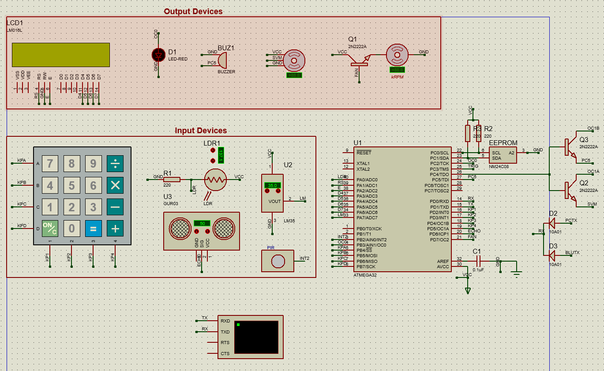
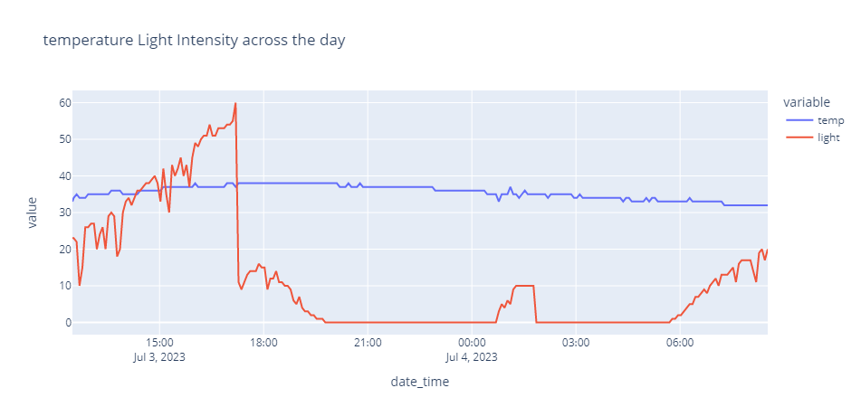

## implementing semi Smart home application using ATMEGA32 and 9 other components

### Features:
- 10 vocal commands and two button can control MicroController From smart phone 
- using python code and windows task schedule to read whether and light status every 5-minutes and store it in csv file for using in monitoring and predicting later
- login to the system using keypad to enter id and password 
- stop system in any time using keypad 
- most of the system can work in parallel 

### components :
* MCU : Atmega32
* Hardware : CLCD ,KeyPad ,LED , BUZZER ,LM35 ,LDR ,DC Motor ,Servo Motor ,Ultrasonic ,PIR ,Bluetooth Module ,usb TTL
* MCU Peripherals :Timer ,ICU ,ADC ,Interrupt ,USART

### vocal commands and buttons 
- control servo motor angle 0 and 180 : "open the door"and "close the door"
- control Led light with vocal : "light on" and "light off"  
    with buttons :"control light using Pir" if PIR sense movement will turn on light for some time and turn off automatic 
&emsp;&emsp;&emsp;&emsp;&emsp;&emsp;"control light using LDR" matching led intensity by surrounded light intensity
- control DC motor (fan) with vocal : "fan on" and "fan off"  
    "control fan with ultrasonic" change fan speed depend on measured distance using ultrasonic 
    "control fan with temperature"turn on fan when the temperature exceed 35 degrees and stop when it is below 30
- control buzzer tone with vocal : "play music" and "stop music" we can do any other command while music is playing or stop music any time

### notes
- CLCD :used in login and to display temperature and light level needed to turn on
- [motor in ultrasonic ,servo motor ,and Buzzer ] : all used timer1 so if any of them has command to run will stop other and start to work
- USART receiving data from pc and HC-05 in parallel using diodes to be able to receiving from two devices 
- keypad share some pins with other components like Buzzer to prevent conflict while login transistor added

for the video link [click here](https://www.linkedin.com/posts/ahmed-mohamed-abdellah_c-embedded-atmega32-activity-7081906468056088576-0SPq?utm_source=share&utm_medium=member_android)
  
### system diagram

### collected data graph using python and plotly express

